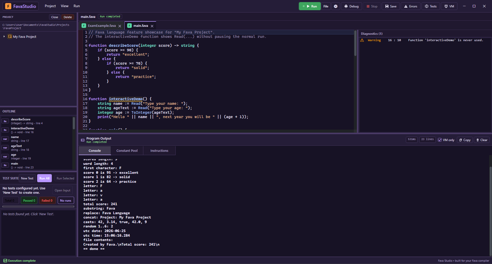
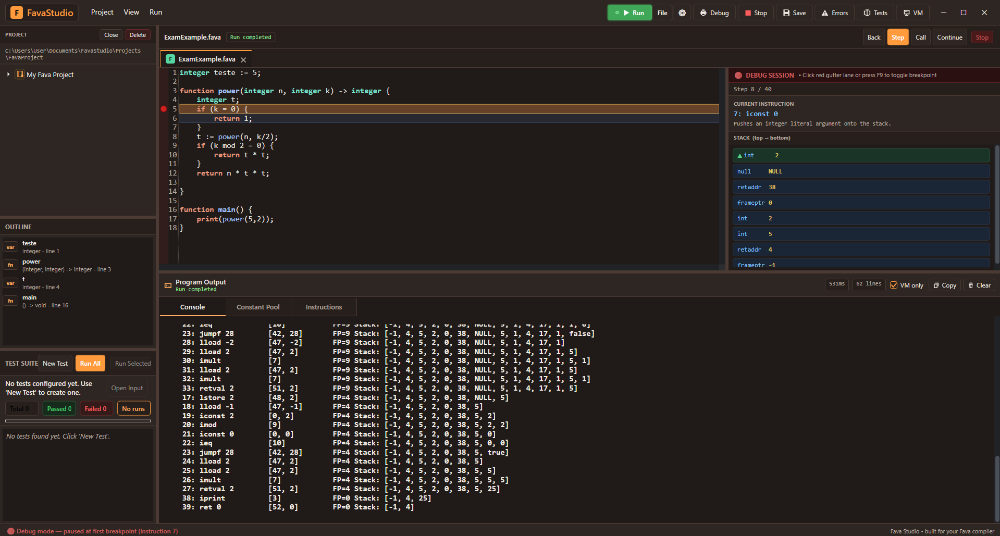
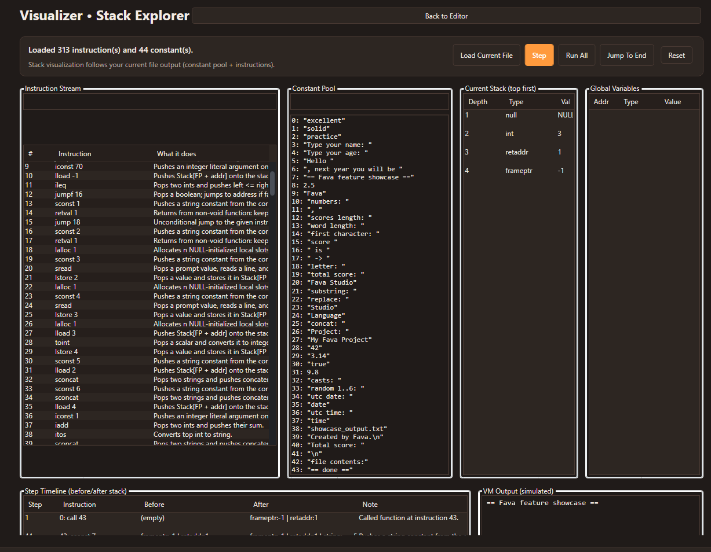
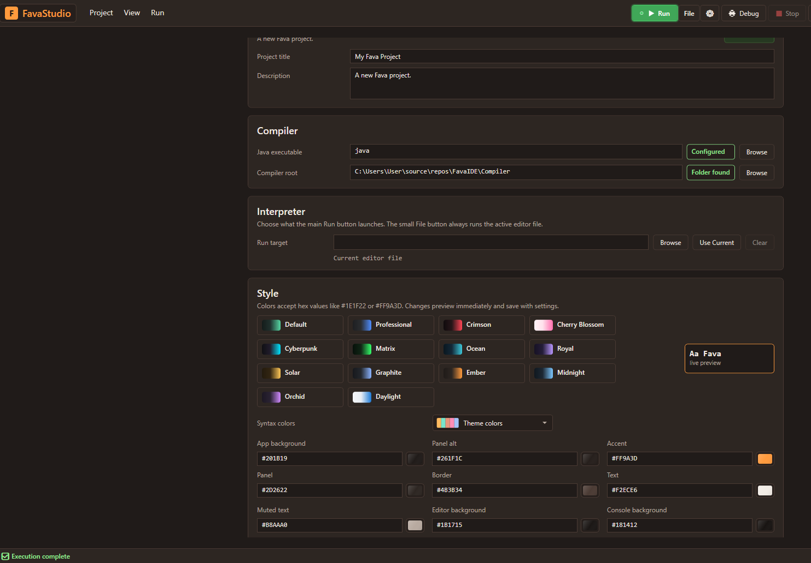
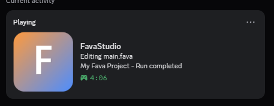

# FavaStudio

FavaStudio is a Windows IDE and compiler workspace for the Fava programming language. It combines a themed code editor, project explorer, diagnostics, compiler integration, runtime output, debugging tools, tests, and a VM stack visualizer in one desktop app.



The project is built around two parts:

- `src/FavaStudio`: the WPF/.NET IDE.
- `Compiler`: the Java/ANTLR compiler, bytecode generator, and virtual machine used by the IDE.

## What Is Fava?

Fava is a small typed programming language designed for learning, experimenting with compiler behavior, and building approachable programs with visible execution feedback.

Fava supports:

- typed variables such as `integer`, `string`, `boolean`, and numeric values
- functions with typed parameters and return values
- conditionals, loops, recursion, and expression evaluation
- strings, arrays, casts, input/output helpers, time/random/file helpers
- modules and imports
- runtime errors and `try` / `catch` blocks, including `catch (exception as ex)`
- bytecode compilation to a custom VM instruction stream

Example:

```fava
function describeScore(integer score) -> string {
    if (score >= 90) {
        return "excellent";
    } else {
        if (score >= 70) {
            return "solid";
        }
        return "practice";
    }
}

function main() {
    string name := Read("Type your name: ");
    integer score := ToInteger(Read("Score: "));
    print("Hello " || name || ", result: " || describeScore(score));
}
```

## IDE Features

- project tree with in-IDE file, folder, rename, and delete workflows
- tabbed editor for `.fava`, `.txt`, `.md`, and related project files
- Markdown preview mode for `.md` files
- syntax highlighting with customizable theme colors
- live diagnostics, warnings, underline rendering, and an errors panel
- integrated compiler/run pipeline with console output
- stronger runtime error reporting and visible failed-run states
- run button state skins that reflect idle, running, success, failure, and stopped states
- debug mode with breakpoints, stepping, call navigation, and stack inspection
- bytecode, constant pool, VM output, and instruction views
- VM stack visualizer with step timeline and simulated output
- test suite tooling for input/output test pairs
- project metadata, recent projects, recent files, and quick open
- configurable Java/compiler paths and UI themes
- Discord Rich Presence integration
- self-contained Windows publish script

## Screenshots

### Editor, Diagnostics, And Program Output


### Debug Mode

Breakpoints, current instruction details, stack values, output, and stepping controls live in the same debugging workspace.



### VM Stack Visualizer

The visualizer loads compiler output and lets you inspect instruction flow, constants, stack changes, globals, and simulated VM output.



### Theme And Syntax Settings

FavaStudio includes multiple themes, custom UI colors, richer syntax color modes, and live preview controls.



### Discord Rich Presence

The IDE can publish project, file, run status, and activity details to Discord.



## Requirements

- Windows 10 or Windows 11
- .NET 8 SDK for building the IDE from source
- Java available on PATH, or configured in FavaStudio settings
- `Compiler/antlr-4.13.2-complete.jar` for regenerating parser sources

The IDE is a WPF desktop app, so running it is Windows-focused. The compiler itself lives in the `Compiler` folder and is Java-based.

## Run From Source

Open the solution in Visual Studio 2022:

```text
FavaStudio.sln
```

Or build from PowerShell:

```powershell
dotnet build src\FavaStudio\FavaStudio.csproj
```

Then run the app from Visual Studio or from the built output.

## Publish A Windows Build

Use the included publish script:

```powershell
./scripts/publish-win-x64.ps1
```

The self-contained output is written to:

```text
publish/win-x64
```

## Compiler Notes

The compiler pipeline is included in this repo:

- `Fava.g4` defines the language grammar.
- ANTLR generates the parser and visitor classes.
- the type checker validates symbols, types, returns, modules, and control flow.
- the code generator emits VM bytecode.
- the VM executes bytecode and reports runtime output or runtime errors.

To rebuild Java compiler classes manually:

```powershell
javac -cp Compiler\antlr-4.13.2-complete.jar -d Compiler\build\classes Compiler\Fava\*.java Compiler\SymbolTable\*.java Compiler\TypeChecker\*.java Compiler\CodeGenerator\*.java Compiler\VM\Instruction\*.java Compiler\VM\*.java Compiler\FavaErrorListener.java Compiler\FavaCompileAndRun.java
```

## Project Structure

```text
FavaIDE/
  Compiler/
    Fava.g4
    CodeGenerator/
    SymbolTable/
    TypeChecker/
    VM/
  docs/
    images/
  scripts/
    publish-win-x64.ps1
  src/
    FavaStudio/
      Editor/
      Models/
      Services/
      Themes/
      ViewModels/
      MainWindow.xaml
  FavaStudio.sln
  README.md
```
